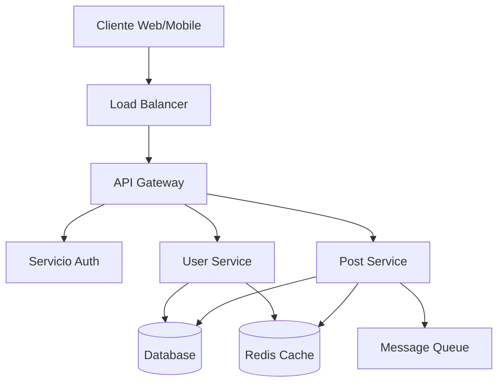

# 📖 Guía 07: Documentación Completa del Proyecto

> **Objetivo:** Crear una documentación profesional y completa que facilite el onboarding y mantenimiento del proyecto.

---

## 📑 Tabla de Contenidos

1. [Estructura de Documentación](#estructura-de-documentación)
2. [README Principal](#readme-principal)
3. [Documentación de API](#documentación-de-api)
4. [Guías de Contribución](#guías-de-contribución)
5. [Documentación Técnica](#documentación-técnica)
6. [Herramientas de Documentación](#herramientas-de-documentación)
7. [Automatización](#automatización)
8. [Checklist](#checklist)

---

## 📁 Estructura de Documentación

### Arquitectura Recomendada

```
docs/
├── README.md                 # Índice principal
├── api/                      # Documentación de API
│   ├── endpoints.md
│   ├── schemas.md
│   └── examples.md
├── guias/                    # Guías de usuario
│   ├── instalacion.md
│   ├── configuracion.md
│   ├── uso-basico.md
│   └── casos-avanzados.md
├── desarrollo/               # Docs para desarrolladores
│   ├── arquitectura.md
│   ├── contribuir.md
│   ├── testing.md
│   └── deployment.md
├── assets/                   # Recursos multimedia
│   ├── images/
│   ├── diagrams/
│   └── videos/
└── templates/                # Plantillas reutilizables
    ├── issue-template.md
    ├── pr-template.md
    └── feature-request.md
```

### Creación de Estructura Base

```bash
# Crear estructura de documentación
mkdir -p docs/{api,guias,desarrollo,assets/{images,diagrams,videos},templates}

# Crear archivos base
touch docs/README.md
touch docs/api/{endpoints,schemas,examples}.md
touch docs/guias/{instalacion,configuracion,uso-basico,casos-avanzados}.md
touch docs/desarrollo/{arquitectura,contribuir,testing,deployment}.md
touch docs/templates/{issue-template,pr-template,feature-request}.md
```

---

## 📋 README Principal

### Template Completo

```markdown
# 🚀 [Nombre del Proyecto]

> Una descripción concisa y atractiva del proyecto

[](LICENSE)
[](https://github.com/usuario/repo/actions)
[](package.json)

## ✨ Características

- 🎯 **Característica 1:** Descripción breve
- 🚀 **Característica 2:** Descripción breve
- 💡 **Característica 3:** Descripción breve

## 🚀 Inicio Rápido

### Prerrequisitos

- Node.js >= 18.0.0
- Python >= 3.9
- Git

### Instalación

```bash
# Clonar el repositorio
git clone https://github.com/usuario/repo.git
cd repo

# Dev Container (Recomendado)
# Abrir en VS Code y usar "Reopen in Container"

# O instalación local
npm install
pip install -r requirements.txt
```

### Uso Básico

```bash
# Iniciar desarrollo
npm run dev

# Ejecutar tests
npm test

# Build para producción
npm run build
```

## 📖 Documentación

- 📘 [Guía de Instalación](docs/guias/instalacion.md)
- 🔧 [Configuración](docs/guias/configuracion.md)
- 🎯 [Uso Básico](docs/guias/uso-basico.md)
- 🚀 [Casos Avanzados](docs/guias/casos-avanzados.md)
- 🏗️ [Arquitectura](docs/desarrollo/arquitectura.md)
- 🤝 [Contribuir](docs/desarrollo/contribuir.md)

## 🛠️ Stack Tecnológico

### Frontend
- **Framework:** React/Vue/Angular
- **Styling:** Tailwind CSS/Styled Components
- **Build:** Vite/Webpack

### Backend
- **Runtime:** Node.js/Python
- **Framework:** Express/FastAPI
- **Database:** PostgreSQL/MongoDB

### DevOps
- **Container:** Docker + Dev Container
- **CI/CD:** GitHub Actions
- **Deploy:** Vercel/Netlify/Railway

## 🤝 Contribuir

¡Las contribuciones son bienvenidas! Por favor lee la [guía de contribución](docs/desarrollo/contribuir.md) para más detalles.

1. Fork el proyecto
2. Crea tu feature branch (`git checkout -b feature/AmazingFeature`)
3. Commit tus cambios (`git commit -m 'Add some AmazingFeature'`)
4. Push al branch (`git push origin feature/AmazingFeature`)
5. Abre un Pull Request

## 📄 Licencia

Este proyecto está bajo la Licencia MIT - ver el archivo [LICENSE](LICENSE) para detalles.

## 🙏 Agradecimientos

- [Herramienta/Librería 1](https://example.com)
- [Inspiración/Tutorial](https://example.com)
- Comunidad de desarrolladores

## 📊 Estado del Proyecto

- ✅ **MVP Completado**
- 🔄 **En desarrollo activo**
- 🎯 **Próximas features:** Ver [Issues](https://github.com/usuario/repo/issues)

---

<div align="center">
  Hecho con ❤️ por [Tu Nombre](https://github.com/tu-usuario)
</div>
```

---

## 🔌 Documentación de API

### Para APIs REST

```markdown
# 🔌 API Documentation

## Base URL
```
https://api.example.com/v1
```

## Authentication
```bash
# Bearer Token
Authorization: Bearer your_token_here
```

## Endpoints

### 📝 Usuarios

#### GET /users
Obtiene lista de usuarios

**Parameters:**
- `page` (query, optional): Número de página (default: 1)
- `limit` (query, optional): Elementos por página (default: 10)

**Response:**
```json
{
  "users": [
    {
      "id": 1,
      "name": "John Doe",
      "email": "john@example.com",
      "created_at": "2024-01-01T00:00:00Z"
    }
  ],
  "pagination": {
    "page": 1,
    "limit": 10,
    "total": 100
  }
}
```

#### POST /users
Crea un nuevo usuario

**Body:**
```json
{
  "name": "John Doe",
  "email": "john@example.com",
  "password": "secure_password"
}
```

**Response:**
```json
{
  "id": 1,
  "name": "John Doe",
  "email": "john@example.com",
  "created_at": "2024-01-01T00:00:00Z"
}
```

### Error Responses

```json
{
  "error": {
    "code": "VALIDATION_ERROR",
    "message": "Invalid email format",
    "details": {
      "field": "email",
      "value": "invalid-email"
    }
  }
}
```
```

### Para GraphQL

```markdown
# 🔌 GraphQL API

## Endpoint
```
POST https://api.example.com/graphql
```

## Schema

### Types

```graphql
type User {
  id: ID!
  name: String!
  email: String!
  posts: [Post!]!
  createdAt: DateTime!
}

type Post {
  id: ID!
  title: String!
  content: String!
  author: User!
  published: Boolean!
}
```

### Queries

```graphql
# Obtener usuarios
query GetUsers($first: Int, $after: String) {
  users(first: $first, after: $after) {
    edges {
      node {
        id
        name
        email
        posts {
          id
          title
        }
      }
    }
    pageInfo {
      hasNextPage
      endCursor
    }
  }
}
```

### Mutations

```graphql
# Crear usuario
mutation CreateUser($input: CreateUserInput!) {
  createUser(input: $input) {
    user {
      id
      name
      email
    }
    errors {
      field
      message
    }
  }
}
```
```

---

## 🤝 Guías de Contribución

### Template CONTRIBUTING.md

```markdown
# 🤝 Guía de Contribución

¡Gracias por tu interés en contribuir! Aquí te explicamos cómo hacerlo.

## 🚀 Formas de Contribuir

- 🐛 **Reportar bugs:** Usa los [issues](../../issues)
- 💡 **Sugerir features:** Abre una [discusión](../../discussions)
- 📝 **Mejorar documentación:** Pull requests bienvenidos
- 🔧 **Código:** Sigue nuestras guías de desarrollo

## 🛠️ Configuración del Entorno

### 1. Fork y Clone

```bash
# Fork el repo en GitHub, luego:
git clone https://github.com/tu-usuario/repo.git
cd repo
git remote add upstream https://github.com/usuario-original/repo.git
```

### 2. Dev Container (Recomendado)

1. Abre VS Code
2. Instala la extensión "Dev Containers"
3. `Ctrl+Shift+P` → "Reopen in Container"

### 3. Instalación Local

```bash
# Node.js dependencies
npm install

# Python dependencies
pip install -r requirements.txt
pip install -r requirements-dev.txt

# Pre-commit hooks
pre-commit install
```

## 📋 Proceso de Desarrollo

### 1. Crear Branch

```bash
# Feature branch
git checkout -b feature/mi-nueva-feature

# Bugfix branch
git checkout -b fix/nombre-del-bug

# Docs branch
git checkout -b docs/mejora-documentacion
```

### 2. Hacer Cambios

- Sigue las [guías de estilo](#guías-de-estilo)
- Añade tests para nuevas funcionalidades
- Actualiza documentación si es necesario

### 3. Testing

```bash
# Run all tests
npm test

# Specific tests
npm run test:unit
npm run test:integration
npm run test:e2e

# Coverage
npm run test:coverage
```

### 4. Commit

```bash
# Seguir conventional commits
git commit -m "feat: add user authentication"
git commit -m "fix: resolve login validation issue"
git commit -m "docs: update API documentation"
```

### 5. Pull Request

1. Push tu branch: `git push origin feature/mi-nueva-feature`
2. Abre PR en GitHub
3. Llena el template de PR
4. Espera review y feedback

## 📝 Guías de Estilo

### Código JavaScript/TypeScript

```javascript
// ✅ Bueno
const getUserById = async (id: string): Promise<User | null> => {
  try {
    const user = await userRepository.findById(id);
    return user;
  } catch (error) {
    logger.error('Error fetching user:', error);
    return null;
  }
};

// ❌ Malo
function getUser(id) {
  return userRepository.findById(id);
}
```

### Código Python

```python
# ✅ Bueno
from typing import Optional

async def get_user_by_id(user_id: str) -> Optional[User]:
    """Get user by ID.
    
    Args:
        user_id: The unique identifier for the user
        
    Returns:
        User object if found, None otherwise
    """
    try:
        return await user_repository.find_by_id(user_id)
    except Exception as e:
        logger.error(f"Error fetching user {user_id}: {e}")
        return None

# ❌ Malo
def getUser(id):
    return user_repository.find_by_id(id)
```

### Commits (Conventional Commits)

```bash
# Tipos válidos
feat:     Nueva funcionalidad
fix:      Bug fix
docs:     Documentación
style:    Formato (no afecta funcionalidad)
refactor: Refactoring
test:     Tests
chore:    Tareas de mantenimiento

# Ejemplos
feat(auth): add JWT token validation
fix(api): resolve user creation error
docs(readme): update installation guide
```

## 🧪 Testing Guidelines

### Unit Tests

```javascript
describe('UserService', () => {
  it('should create user with valid data', async () => {
    const userData = { name: 'John', email: 'john@test.com' };
    const user = await userService.create(userData);
    
    expect(user).toBeDefined();
    expect(user.name).toBe('John');
    expect(user.email).toBe('john@test.com');
  });
});
```

### Integration Tests

```python
class TestUserAPI:
    async def test_create_user_success(self, client):
        user_data = {
            "name": "John Doe",
            "email": "john@test.com"
        }
        
        response = await client.post("/users", json=user_data)
        
        assert response.status_code == 201
        assert response.json()["name"] == "John Doe"
```

## 📋 Checklist de PR

- [ ] 🧪 Tests pasan (`npm test`)
- [ ] 📝 Documentación actualizada
- [ ] 🎨 Código formateado (`npm run format`)
- [ ] 🔍 Linting sin errores (`npm run lint`)
- [ ] 📋 Commit messages siguen convención
- [ ] 🔄 Branch actualizado con main
- [ ] 📖 PR description completa

## ❓ ¿Necesitas Ayuda?

- 💬 [Discusiones](../../discussions) para preguntas generales
- 🐛 [Issues](../../issues) para bugs
- 📧 Email: maintainer@example.com

¡Gracias por contribuir! 🎉
```

---

## 🏗️ Documentación Técnica

### Arquitectura del Sistema

```markdown
# 🏗️ Arquitectura del Sistema

## Overview



## Componentes

### Frontend
- **Framework:** React 18 con TypeScript
- **State Management:** Zustand
- **Styling:** Tailwind CSS
- **Build:** Vite

### Backend
- **Runtime:** Node.js 18+
- **Framework:** Express.js con TypeScript
- **Authentication:** JWT + Refresh Tokens
- **Database:** PostgreSQL con Prisma ORM
- **Cache:** Redis
- **Queue:** Bull Queue

### Infrastructure
- **Container:** Docker + Docker Compose
- **Deployment:** Kubernetes
- **Monitoring:** Prometheus + Grafana
- **Logging:** ELK Stack

## Patrones de Diseño

### Repository Pattern
```typescript
interface UserRepository {
  findById(id: string): Promise<User | null>;
  create(data: CreateUserData): Promise<User>;
  update(id: string, data: UpdateUserData): Promise<User>;
  delete(id: string): Promise<void>;
}
```

### Service Layer
```typescript
class UserService {
  constructor(
    private userRepo: UserRepository,
    private emailService: EmailService
  ) {}

  async createUser(data: CreateUserData): Promise<User> {
    const user = await this.userRepo.create(data);
    await this.emailService.sendWelcomeEmail(user.email);
    return user;
  }
}
```

## Security

### Authentication Flow
1. Usuario envía credenciales
2. Server valida y genera JWT
3. Cliente guarda token en httpOnly cookie
4. Requests incluyen token en headers
5. Server valida token en cada request

### Authorization
- **RBAC:** Role-Based Access Control
- **Scopes:** Permisos granulares por endpoint
- **Rate Limiting:** Protección contra abuse

## Performance

### Caching Strategy
- **Browser Cache:** Static assets (24h)
- **CDN Cache:** Images, videos (7 days)
- **Redis Cache:** API responses (1h)
- **Database Cache:** Query results (15min)

### Database Optimization
- **Indexing:** Campos de búsqueda frecuente
- **Connection Pooling:** Max 20 conexiones
- **Query Optimization:** Uso de EXPLAIN ANALYZE
```

---

## 🛠️ Herramientas de Documentación

### 1. JSDoc para JavaScript/TypeScript

```javascript
/**
 * Calcula el precio total con descuento aplicado
 * @param {number} price - Precio base del producto
 * @param {number} discount - Porcentaje de descuento (0-100)
 * @param {Object} options - Opciones adicionales
 * @param {boolean} options.includeTax - Si incluir impuestos
 * @param {number} options.taxRate - Tasa de impuestos (default: 0.21)
 * @returns {number} Precio final calculado
 * @throws {Error} Si el descuento es inválido
 * @example
 * // Calcular precio con 10% descuento
 * const finalPrice = calculatePrice(100, 10, { includeTax: true });
 * console.log(finalPrice); // 94.5
 */
function calculatePrice(price, discount, options = {}) {
  if (discount < 0 || discount > 100) {
    throw new Error('Discount must be between 0 and 100');
  }
  
  const { includeTax = false, taxRate = 0.21 } = options;
  let finalPrice = price * (1 - discount / 100);
  
  if (includeTax) {
    finalPrice *= (1 + taxRate);
  }
  
  return finalPrice;
}
```

### 2. Sphinx para Python

```python
def calculate_price(price: float, discount: float, *, include_tax: bool = False, tax_rate: float = 0.21) -> float:
    """Calculate final price with discount applied.
    
    Args:
        price: Base price of the product
        discount: Discount percentage (0-100)
        include_tax: Whether to include taxes in calculation
        tax_rate: Tax rate to apply (default: 0.21)
        
    Returns:
        Final calculated price
        
    Raises:
        ValueError: If discount is not between 0 and 100
        
    Example:
        >>> calculate_price(100, 10, include_tax=True)
        94.5
        
    Note:
        Tax is applied after discount calculation.
    """
    if not 0 <= discount <= 100:
        raise ValueError("Discount must be between 0 and 100")
    
    final_price = price * (1 - discount / 100)
    
    if include_tax:
        final_price *= (1 + tax_rate)
    
    return final_price
```

### 3. OpenAPI para APIs

```yaml
# openapi.yml
openapi: 3.0.0
info:
  title: Mi API
  version: 1.0.0
  description: API para gestión de usuarios

paths:
  /users:
    get:
      summary: Obtener lista de usuarios
      parameters:
        - name: page
          in: query
          schema:
            type: integer
            default: 1
        - name: limit
          in: query
          schema:
            type: integer
            default: 10
      responses:
        '200':
          description: Lista de usuarios
          content:
            application/json:
              schema:
                type: object
                properties:
                  users:
                    type: array
                    items:
                      $ref: '#/components/schemas/User'
    post:
      summary: Crear nuevo usuario
      requestBody:
        required: true
        content:
          application/json:
            schema:
              $ref: '#/components/schemas/CreateUser'
      responses:
        '201':
          description: Usuario creado
          content:
            application/json:
              schema:
                $ref: '#/components/schemas/User'

components:
  schemas:
    User:
      type: object
      properties:
        id:
          type: integer
        name:
          type: string
        email:
          type: string
          format: email
    CreateUser:
      type: object
      required:
        - name
        - email
      properties:
        name:
          type: string
        email:
          type: string
          format: email
```

### 4. Storybook para Componentes

```javascript
// Button.stories.js
export default {
  title: 'Components/Button',
  component: Button,
  parameters: {
    docs: {
      description: {
        component: 'Botón reutilizable con múltiples variantes.'
      }
    }
  },
  argTypes: {
    variant: {
      control: { type: 'select' },
      options: ['primary', 'secondary', 'danger'],
      description: 'Variante visual del botón'
    },
    size: {
      control: { type: 'select' },
      options: ['sm', 'md', 'lg'],
      description: 'Tamaño del botón'
    }
  }
};

export const Primary = {
  args: {
    variant: 'primary',
    children: 'Button Primary'
  }
};

export const Secondary = {
  args: {
    variant: 'secondary',
    children: 'Button Secondary'
  }
};

export const AllSizes = () => (
  <div style={{ display: 'flex', gap: '10px' }}>
    <Button size="sm">Small</Button>
    <Button size="md">Medium</Button>
    <Button size="lg">Large</Button>
  </div>
);
```

---

## 🤖 Automatización

### 1. GitHub Actions para Docs

```yaml
# .github/workflows/docs.yml
name: 📖 Documentation

on:
  push:
    paths:
      - 'docs/**'
      - '*.md'
  pull_request:
    paths:
      - 'docs/**'
      - '*.md'

jobs:
  lint-docs:
    runs-on: ubuntu-latest
    steps:
      - uses: actions/checkout@v4
      
      - name: 📝 Lint Markdown
        uses: articulate/actions-markdownlint@v1
        with:
          config: .markdownlint.json
          files: '**/*.md'
          
      - name: 🔗 Check Links
        uses: gaurav-nelson/github-action-markdown-link-check@v1
        with:
          use-quiet-mode: 'yes'
          
  build-docs:
    runs-on: ubuntu-latest
    if: github.ref == 'refs/heads/main'
    steps:
      - uses: actions/checkout@v4
      
      - name: 📚 Build API Docs
        run: |
          npm install
          npm run docs:build
          
      - name: 🚀 Deploy to GitHub Pages
        uses: peaceiris/actions-gh-pages@v3
        with:
          github_token: ${{ secrets.GITHUB_TOKEN }}
          publish_dir: ./docs/build
```

### 2. Scripts de Generación

```bash
#!/bin/bash
# scripts/generate-docs.sh

set -e

echo "🔄 Generando documentación..."

# API Documentation
echo "📚 Generando docs de API..."
npx swagger-jsdoc -d swaggerDef.js -o docs/api/swagger.json src/routes/*.js
npx redoc-cli build docs/api/swagger.json --output docs/api/index.html

# Code Documentation
echo "📖 Generando docs de código..."
npx typedoc src --out docs/code

# Python Documentation
if [ -f "requirements.txt" ]; then
    echo "🐍 Generando docs de Python..."
    sphinx-build -b html docs/sphinx docs/python
fi

# Component Documentation
if [ -f "package.json" ] && grep -q "storybook" package.json; then
    echo "📱 Generando Storybook..."
    npm run build-storybook
fi

echo "✅ Documentación generada exitosamente!"
```

### 3. Pre-commit Hook para Docs

```yaml
# .pre-commit-config.yaml
repos:
  - repo: https://github.com/pre-commit/pre-commit-hooks
    rev: v4.4.0
    hooks:
      - id: check-markdown
      - id: check-yaml
      - id: trailing-whitespace
        files: '\.md$'
      - id: end-of-file-fixer
        files: '\.md$'
        
  - repo: https://github.com/igorshubovych/markdownlint-cli
    rev: v0.37.0
    hooks:
      - id: markdownlint
        args: ['--config', '.markdownlint.json']
        
  - repo: local
    hooks:
      - id: generate-toc
        name: Generate Table of Contents
        entry: scripts/generate-toc.sh
        language: script
        files: '\.md$'
```

---

## ✅ Checklist

### 📋 Documentación Básica
- [ ] README.md completo y atractivo
- [ ] CONTRIBUTING.md con guías claras
- [ ] LICENSE file apropiado
- [ ] Estructura de docs/ organizada
- [ ] API documentation actualizada

### 🔧 Herramientas Configuradas
- [ ] JSDoc/Sphinx para code docs
- [ ] OpenAPI/Swagger para API docs
- [ ] Storybook para componentes (si aplica)
- [ ] Markdown linting configurado
- [ ] Link checking automatizado

### 🤖 Automatización
- [ ] GitHub Actions para docs
- [ ] Scripts de generación automática
- [ ] Pre-commit hooks configurados
- [ ] Deploy automático a GitHub Pages
- [ ] Validación de enlaces

### 📝 Contenido de Calidad
- [ ] Ejemplos de código funcionales
- [ ] Guías paso a paso claras
- [ ] FAQ sections útiles
- [ ] Troubleshooting guides
- [ ] Changelog mantenido

### 🎯 Experiencia de Usuario
- [ ] Navegación intuitiva
- [ ] Búsqueda fácil de información
- [ ] Onboarding claro para nuevos usuarios
- [ ] Diferentes niveles de detalle
- [ ] Feedback mechanisms

---

## ❓ FAQ

### ¿Cómo mantener la documentación actualizada?

**R:** Usa automatización:
- GitHub Actions para validar en cada PR
- Pre-commit hooks para checks locales
- Generación automática desde código
- Reviews obligatorios para cambios en docs

### ¿Qué herramientas usar para diferentes tipos de docs?

**R:** Depende del propósito:
- **API:** OpenAPI/Swagger, Postman
- **Código:** JSDoc, Sphinx, rustdoc
- **Componentes:** Storybook, Styleguidist
- **Usuario:** Markdown, GitBook, Notion

### ¿Cómo hacer la documentación más atractiva?

**R:** Elementos visuales:
- Badges de estado del proyecto
- Diagramas con Mermaid
- Screenshots y GIFs
- Emojis para mejor legibilidad
- Ejemplos interactivos

---

## 🔗 Siguiente Paso

➡️ **[Guía 08: Configuración de Codespaces](08-codespaces-config.md)**

---

## 📚 Recursos Adicionales

- [Markdown Guide](https://www.markdownguide.org/)
- [OpenAPI Specification](https://swagger.io/specification/)
- [JSDoc Documentation](https://jsdoc.app/)
- [Sphinx Documentation](https://www.sphinx-doc.org/)
- [Storybook Documentation](https://storybook.js.org/)
- [GitHub Pages](https://pages.github.com/)
