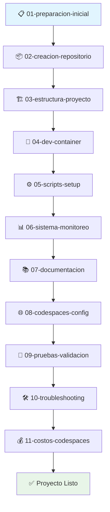

# 📚 Guías de Arquitectura Dual (Local + Codespaces)

Esta carpeta contiene guías modulares para replicar la arquitectura dual del proyecto tic-tac-toe-agent en nuevos repositorios.

## 🗂️ Estructura de Guías

### 📝 Guías Principales
- **[01-preparacion-inicial.md](01-preparacion-inicial.md)** - Requisitos previos y herramientas necesarias
- **[02-creacion-repositorio.md](02-creacion-repositorio.md)** - Crear y configurar el repositorio en GitHub
- **[03-estructura-proyecto.md](03-estructura-proyecto.md)** - Organización de archivos y directorios
- **[04-dev-container.md](04-dev-container.md)** - Configuración completa de Dev Container
- **[05-scripts-setup.md](05-scripts-setup.md)** - Scripts de automatización y ejecución
- **[06-sistema-monitoreo.md](06-sistema-monitoreo.md)** - Monitoreo de rendimiento y recursos
- **[07-documentacion.md](07-documentacion.md)** - Templates y estructura de documentación
- **[08-codespaces-config.md](08-codespaces-config.md)** - Configuración específica de GitHub Codespaces
- **[09-pruebas-validacion.md](09-pruebas-validacion.md)** - Testing y validación del setup
- **[10-troubleshooting.md](10-troubleshooting.md)** - Solución de problemas comunes
- **[11-costos-codespaces.md](11-costos-codespaces.md)** - Gestión de costos y optimización financiera

### 🛠️ Guías de Stacks Específicos
- **[stack-python.md](stack-python.md)** - Configuración específica para proyectos Python
- **[stack-nodejs.md](stack-nodejs.md)** - Configuración específica para proyectos Node.js
- **[stack-fullstack.md](stack-fullstack.md)** - Configuración para proyectos Full-Stack

### 🎯 Guías de Casos de Uso
- **[caso-uso-educacion.md](caso-uso-educacion.md)** - Setup para proyectos educativos
- **[caso-uso-startup.md](caso-uso-startup.md)** - Setup para startups y proyectos comerciales
- **[caso-uso-hackathon.md](caso-uso-hackathon.md)** - Setup rápido para hackathons

## 🚀 Cómo Usar Estas Guías

### 📖 Lectura Secuencial (Recomendado para principiantes)
Sigue las guías numeradas en orden para un setup completo paso a paso.

### 🎯 Lectura por Objetivos (Para usuarios con experiencia)
1. **Setup Básico**: Guías 01-04
2. **Automatización**: Guías 05-06
3. **Documentación**: Guía 07
4. **Codespaces**: Guía 08
5. **Validación**: Guías 09-10
6. **Gestión de Costos**: Guía 11

### ⚡ Setup Rápido (Para usuarios avanzados)
Usa el [generador automatizado](../GUIA-GENERADOR-AUTOMATIZADO.md) para crear toda la estructura automáticamente.

## 🔄 Flujo de Trabajo Recomendado

## 🆘 Soporte y Ayuda

- **Problemas técnicos**: Consulta [10-troubleshooting.md](10-troubleshooting.md)
- **Preguntas frecuentes**: Cada guía incluye una sección de FAQ
- **Mejores prácticas**: Documentadas en cada guía específica
- **Ejemplos prácticos**: Incluidos en las guías de casos de uso

## 🔗 Enlaces Rápidos

- [🚀 Generador Automatizado](../GUIA-GENERADOR-AUTOMATIZADO.md)
- [📖 Guía Original Completa](../../GUIA-NUEVO-REPOSITORIO.md)
- [🎮 Proyecto Base: tic-tac-toe-agent](../../README.md)
